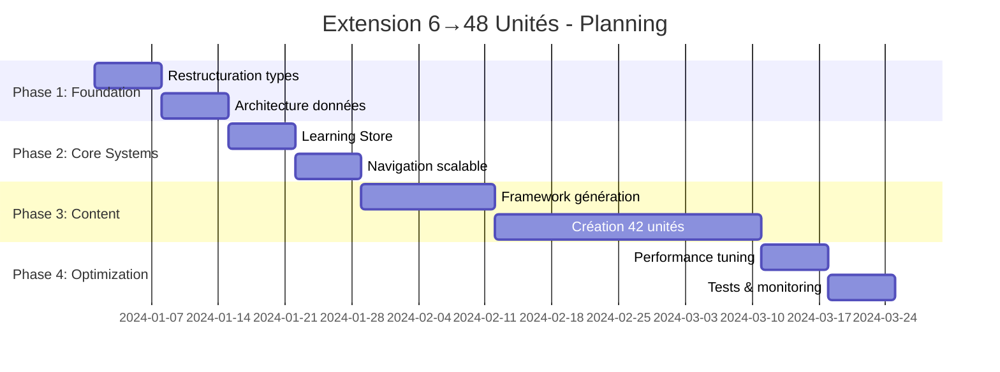

# Architecture Analysis & Recommendations: Extension 6→48 Units
## Application d'apprentissage du Luxembourgeois

### 📋 Sommaire Exécutif

Cette analyse examine l'architecture actuelle de l'application d'apprentissage du luxembourgeois et propose des recommandations détaillées pour l'extension de 6 unités (3 sections) vers 48 unités (6 sections) avec une progression A1→B2.

---

## 🔍 I. ANALYSE DE L'ARCHITECTURE ACTUELLE

### 1.1 Stack Technologique
```typescript
// Configuration actuelle
- React 18.2.0 + TypeScript 4.9.5
- Material-UI v7 (composants + icons)
- Emotion (styling)
- Web APIs natives (Speech Recognition, SpeechSynthesis)
- Architecture: SPA single-bundle
```

### 1.2 Architecture des Données

#### Types Principaux (LearningTypes.ts)
```typescript
interface VocabularyItem {
  id: string
  luxembourgish: string
  french: string
  pronunciation: string
  audioUrl?: string        // ⚠️ Pas utilisé actuellement
  imageUrl?: string        // ⚠️ Pas utilisé actuellement
  usage: string
}

interface LearningUnit {
  id: string
  title: string
  description: string
  level: 'A1' | 'A2' | 'B1' | 'B2'
  vocabulary: VocabularyItem[]
  exercises: Exercise[]
  targetScore: number
  estimatedTime: number
}

interface PathSection {
  id: string
  title: string
  description: string
  color: string           // Codage couleur par section
  nodes: PathNode[]
  order: number
}
```

#### Structure de Données Actuelle
```
📁 data/
├── LearningPathData.ts     → Configuration du parcours (3 sections, 6 unités)
├── Unit1Data.ts           → Unité complète avec génération d'exercices
├── Unit2Data.ts           → Vocabulaire + exercices générés
├── Unit3-6Data.ts         → Unités existantes
└── Unit6-8NewData.ts      → Extensions en cours
```

**Points forts identifiés:**
- ✅ Types TypeScript bien définis et extensibles
- ✅ Séparation claire données/logique
- ✅ Structure modulaire par unité
- ✅ Génération programmatique d'exercices

**Limitations pour 48 unités:**
- ❌ Chargement synchrone de toutes les données
- ❌ Pas de lazy loading des unités
- ❌ Structure de fichiers non scalable
- ❌ Absence de groupement par niveau CECR

### 1.3 Architecture des Composants

#### Hiérarchie Actuelle
```
App.tsx
├── LearningPath.tsx              → Parcours principal + navigation
│   ├── LearningUnit.tsx          → Conteneur d'unité + progression
│   └── exercises/
│       ├── AudioRecognitionExercise.tsx
│       ├── TranslationExercise.tsx
│       ├── DialogueCompletionExercise.tsx
│       ├── SentenceConstructionExercise.tsx
│       ├── SpeechRecognitionExercise.tsx
│       ├── PronunciationExercise.tsx
│       └── ImageAssociationExercise.tsx
├── ProgressBar.tsx
├── UnitCompletion.tsx
└── utilitaires/
```

**Points forts:**
- ✅ Séparation claire des responsabilités
- ✅ Composants d'exercices modulaires et réutilisables
- ✅ Props typing strict
- ✅ Architecture Material-UI cohérente

**Limitations:**
- ❌ Pas de code splitting par exercice
- ❌ Composants non optimisés pour grandes collections
- ❌ Absence de système de cache/memoization

### 1.4 Gestion de l'État

#### État Actuel (Local State)
```typescript
// LearningPath.tsx
const [sections, setSections] = useState<PathSection[]>()
const [completedNodes, setCompletedNodes] = useState<string[]>()
const [selectedNode, setSelectedNode] = useState<PathNode | null>()

// LearningUnit.tsx
const [currentExerciseIndex, setCurrentExerciseIndex] = useState(0)
const [exerciseResults, setExerciseResults] = useState<ExerciseResult[]>()
const [hearts, setHearts] = useState(5)
```

**Problèmes identifiés:**
- ❌ Aucune persistance des données utilisateur
- ❌ État local fragile (perte au refresh)
- ❌ Pas de synchronisation cross-session
- ❌ Duplication de logique de progression

### 1.5 Services

#### AudioService.ts
```typescript
class AudioService {
  // ✅ Synthèse vocale luxembourgeoise avec fallbacks
  // ✅ Sons de feedback (succès/erreur/progression)
  // ✅ Corrections phonétiques intelligentes
  // ⚠️ Pas de cache audio
  // ⚠️ Pas de preloading
}
```

#### SpeechRecognitionService.ts
```typescript
class SpeechRecognitionService {
  // ✅ Reconnaissance vocale avec calcul de similarité
  // ✅ Support multi-langues (DE/LB fallback)
  // ✅ Normalisation et scoring avancé
  // ⚠️ Pas d'optimisation pour mobile
}
```

---

## 🎯 II. RECOMMANDATIONS ARCHITECTURALES POUR 48 UNITÉS

### 2.1 Architecture de Données Optimisée

#### Nouveau Modèle Hiérarchique
```typescript
// Nouveau type: Niveau CECR
interface CECRLevel {
  id: 'A1' | 'A2' | 'B1' | 'B2'
  title: string
  description: string
  color: string
  estimatedDuration: number  // heures total
  sections: Section[]
}

// Nouveau type: Section thématique
interface Section {
  id: string
  cecrLevel: 'A1' | 'A2' | 'B1' | 'B2'
  title: string
  description: string
  units: LearningUnit[]
  prerequisites?: string[]   // IDs sections précédentes
  order: number
}

// Extension LearningUnit
interface LearningUnit {
  // ... propriétés existantes
  sectionId: string
  cecrLevel: 'A1' | 'A2' | 'B1' | 'B2'
  prerequisites?: string[]   // IDs unités précédentes
  difficulty: 1 | 2 | 3     // Complexité dans le niveau
  themes: string[]          // Tags thématiques
  grammarPoints?: string[]  // Points grammaticaux couverts
}
```

#### Structure de Fichiers Scalable
```
📁 src/data/
├── 📁 levels/
│   ├── A1/
│   │   ├── index.ts                    → Export du niveau A1
│   │   ├── A1-Section1-Basics/
│   │   │   ├── index.ts
│   │   │   ├── Unit1-Greetings.ts
│   │   │   ├── Unit2-Introduction.ts
│   │   │   └── Unit3-Politeness.ts
│   │   ├── A1-Section2-Family/
│   │   │   ├── index.ts
│   │   │   ├── Unit4-Family.ts
│   │   │   ├── Unit5-House.ts
│   │   │   └── Unit6-DailyLife.ts
│   │   └── A1-Section3-Time/
│   │       ├── index.ts
│   │       ├── Unit7-Time.ts
│   │       ├── Unit8-Calendar.ts
│   │       └── Unit9-Weather.ts
│   ├── A2/
│   │   ├── index.ts
│   │   ├── A2-Section1-Activities/
│   │   ├── A2-Section2-Travel/
│   │   └── A2-Section3-Shopping/
│   ├── B1/
│   │   ├── index.ts
│   │   ├── B1-Section1-Work/
│   │   ├── B1-Section2-Culture/
│   │   └── B1-Section3-Society/
│   └── B2/
│       ├── index.ts
│       ├── B2-Section1-Complex/
│       ├── B2-Section2-Academic/
│       └── B2-Section3-Professional/
├── 📁 shared/
│   ├── CommonVocabulary.ts             → Mots fréquents partagés
│   ├── ExerciseTemplates.ts            → Templates d'exercices réutilisables
│   └── ProgressionRules.ts             → Règles de déblocage
└── 📁 content/
    ├── 📁 audio/                       → Fichiers audio pre-générés
    ├── 📁 images/                      → Images pour exercices
    └── 📁 schemas/                     → Validation de structure
```

### 2.2 Lazy Loading et Performance

#### Système de Chargement Dynamique
```typescript
// data/levels/LevelLoader.ts
export class LevelLoader {
  private static cache = new Map<string, CECRLevel>()

  static async loadLevel(levelId: string): Promise<CECRLevel> {
    if (this.cache.has(levelId)) {
      return this.cache.get(levelId)!
    }

    const level = await import(`./levels/${levelId}/index.ts`)
    this.cache.set(levelId, level.default)
    return level.default
  }

  static async loadSection(levelId: string, sectionId: string): Promise<Section> {
    const module = await import(`./levels/${levelId}/${sectionId}/index.ts`)
    return module.default
  }

  static async loadUnit(path: string): Promise<LearningUnit> {
    const module = await import(`./levels/${path}`)
    return module.default
  }
}
```

#### Optimisation Bundle
```typescript
// webpack configuration optimization
const bundleConfig = {
  splitChunks: {
    chunks: 'all',
    cacheGroups: {
      // Chunk séparé par niveau CECR
      levelA1: {
        test: /src\/data\/levels\/A1/,
        name: 'level-a1',
        chunks: 'all'
      },
      levelA2: {
        test: /src\/data\/levels\/A2/,
        name: 'level-a2',
        chunks: 'all'
      },
      // ... B1, B2

      // Chunk pour exercices
      exercises: {
        test: /src\/components\/exercises/,
        name: 'exercises',
        chunks: 'all'
      }
    }
  }
}
```

### 2.3 Gestion d'État Avancée

#### Store Global avec Context API
```typescript
// store/LearningStore.tsx
interface LearningStore {
  // Progression utilisateur
  userProgress: {
    completedUnits: string[]
    currentLevel: 'A1' | 'A2' | 'B1' | 'B2'
    unlockedSections: string[]
    streakDays: number
    totalXP: number
    achievements: Achievement[]
  }

  // État d'apprentissage
  currentSession: {
    levelId?: string
    sectionId?: string
    unitId?: string
    exerciseIndex: number
    startTime: Date
    hearts: number
  }

  // Cache de contenu
  loadedContent: {
    levels: Map<string, CECRLevel>
    sections: Map<string, Section>
    units: Map<string, LearningUnit>
  }

  // Paramètres utilisateur
  userSettings: {
    audioEnabled: boolean
    speechEnabled: boolean
    difficlutyMode: 'easy' | 'normal' | 'hard'
    preferredLanguage: 'fr' | 'en'
  }
}

const LearningContext = React.createContext<{
  store: LearningStore
  actions: LearningActions
}>()
```

#### Actions et Persistance
```typescript
// store/LearningActions.ts
interface LearningActions {
  // Progression
  completeUnit(unitId: string, score: number): Promise<void>
  unlockSection(sectionId: string): Promise<void>
  updateStreak(): Promise<void>

  // Navigation
  navigateToLevel(levelId: string): Promise<void>
  navigateToSection(sectionId: string): Promise<void>
  navigateToUnit(unitId: string): Promise<void>

  // Contenu
  preloadLevel(levelId: string): Promise<void>
  preloadSection(sectionId: string): Promise<void>

  // Persistance
  saveProgress(): Promise<void>
  loadProgress(): Promise<void>
  syncProgress(): Promise<void>  // Future: sync cloud
}

// store/LocalStorage.ts
export class ProgressStorage {
  private static readonly STORAGE_KEY = 'letz-learn-progress'

  static save(store: LearningStore): void {
    const serializable = {
      userProgress: store.userProgress,
      userSettings: store.userSettings,
      timestamp: Date.now()
    }
    localStorage.setItem(this.STORAGE_KEY, JSON.stringify(serializable))
  }

  static load(): Partial<LearningStore> | null {
    const data = localStorage.getItem(this.STORAGE_KEY)
    if (!data) return null

    try {
      return JSON.parse(data)
    } catch {
      return null
    }
  }
}
```

### 2.4 Architecture de Navigation Scalable

#### Nouveau Composant LearningPathV2
```typescript
// components/navigation/LearningPathV2.tsx
interface LearningPathV2Props {
  onNavigate: (path: NavigationPath) => void
}

interface NavigationPath {
  type: 'level' | 'section' | 'unit'
  levelId?: string
  sectionId?: string
  unitId?: string
}

const LearningPathV2: React.FC<LearningPathV2Props> = ({ onNavigate }) => {
  const { store, actions } = useLearningStore()
  const [viewMode, setViewMode] = useState<'levels' | 'sections' | 'units'>('levels')

  // Virtualization pour performances avec 48+ unités
  const virtualizedSections = useMemo(() => {
    return store.loadedContent.sections
  }, [store.loadedContent.sections])

  return (
    <div className="learning-path-v2">
      <PathHeader
        currentLevel={store.userProgress.currentLevel}
        totalProgress={calculateGlobalProgress(store.userProgress)}
        viewMode={viewMode}
        onViewModeChange={setViewMode}
      />

      {viewMode === 'levels' && (
        <LevelsGrid
          levels={CECR_LEVELS}
          userProgress={store.userProgress}
          onLevelSelect={(levelId) => onNavigate({ type: 'level', levelId })}
        />
      )}

      {viewMode === 'sections' && (
        <SectionsPath
          sections={virtualizedSections}
          userProgress={store.userProgress}
          onSectionSelect={(sectionId) => onNavigate({ type: 'section', sectionId })}
        />
      )}

      {viewMode === 'units' && (
        <UnitsGrid
          units={getUnitsForCurrentLevel(store)}
          userProgress={store.userProgress}
          onUnitSelect={(unitId) => onNavigate({ type: 'unit', unitId })}
        />
      )}
    </div>
  )
}
```

#### Filtrage et Recherche
```typescript
// components/navigation/NavigationFilters.tsx
interface NavigationFilters {
  level: 'A1' | 'A2' | 'B1' | 'B2' | 'all'
  theme: string[]
  difficulty: number[]
  status: 'completed' | 'unlocked' | 'locked' | 'all'
  searchQuery: string
}

const NavigationFilters: React.FC = () => {
  const [filters, setFilters] = useState<NavigationFilters>({
    level: 'all',
    theme: [],
    difficulty: [],
    status: 'all',
    searchQuery: ''
  })

  return (
    <FilterPanel>
      <LevelSelector value={filters.level} onChange={(level) => setFilters(f => ({...f, level}))} />
      <ThemeSelector values={filters.theme} onChange={(theme) => setFilters(f => ({...f, theme}))} />
      <DifficultySelector values={filters.difficulty} onChange={(difficulty) => setFilters(f => ({...f, difficulty}))} />
      <StatusSelector value={filters.status} onChange={(status) => setFilters(f => ({...f, status}))} />
      <SearchInput value={filters.searchQuery} onChange={(searchQuery) => setFilters(f => ({...f, searchQuery}))} />
    </FilterPanel>
  )
}
```

### 2.5 Système d'Exercices Modulaire

#### Factory Pattern pour Exercices
```typescript
// exercises/ExerciseFactory.ts
export class ExerciseFactory {
  private static generators = new Map<ExerciseType, ExerciseGenerator>()

  static registerGenerator(type: ExerciseType, generator: ExerciseGenerator): void {
    this.generators.set(type, generator)
  }

  static generateExercises(
    vocabulary: VocabularyItem[],
    type: ExerciseType,
    count: number,
    options?: ExerciseOptions
  ): Exercise[] {
    const generator = this.generators.get(type)
    if (!generator) {
      throw new Error(`No generator registered for exercise type: ${type}`)
    }

    return generator.generate(vocabulary, count, options)
  }

  static generateAdaptiveExercise(
    vocabulary: VocabularyItem[],
    userHistory: ExerciseResult[],
    targetDifficulty: number
  ): Exercise {
    // Algorithme adaptatif basé sur l'historique
    const weakWords = analyzeWeaknesses(userHistory, vocabulary)
    const preferredTypes = analyzePreferences(userHistory)

    return this.generateExercises(
      weakWords,
      preferredTypes[0],
      1,
      { difficulty: targetDifficulty }
    )[0]
  }
}

// exercises/generators/TranslationGenerator.ts
export class TranslationGenerator implements ExerciseGenerator {
  generate(vocabulary: VocabularyItem[], count: number, options?: ExerciseOptions): Exercise[] {
    const exercises: Exercise[] = []
    const distractorPool = buildDistractorPool(vocabulary, options?.themes)

    for (let i = 0; i < count; i++) {
      const vocab = vocabulary[i % vocabulary.length]

      exercises.push({
        id: `translation_${vocab.id}_${Date.now()}_${i}`,
        type: 'translation',
        vocabularyItem: vocab,
        question: `Comment dit-on "${vocab.french}" en luxembourgeois ?`,
        options: [
          vocab.luxembourgish,
          ...selectDistractors(distractorPool, vocab, 3)
        ].sort(() => Math.random() - 0.5),
        correctAnswer: vocab.luxembourgish,
        difficulty: options?.difficulty ?? calculateDifficulty(vocab),
        adaptiveWeight: calculateAdaptiveWeight(vocab, options?.userHistory)
      })
    }

    return exercises
  }
}
```

#### Exercices Adaptatifs
```typescript
// exercises/AdaptiveSystem.ts
interface AdaptiveExerciseSystem {
  userModel: UserModel
  difficultyCalculator: DifficultyCalculator
  exerciseSelector: ExerciseSelector
}

interface UserModel {
  strongTopics: string[]          // Sujets maîtrisés
  weakTopics: string[]            // Sujets à travailler
  preferredExerciseTypes: ExerciseType[]
  averageResponseTime: number
  accuracyByTopic: Record<string, number>
  learningSpeed: number           // Vitesse d'apprentissage
}

class AdaptiveExerciseSystem {
  generateNextExercise(
    availableVocabulary: VocabularyItem[],
    userModel: UserModel,
    sessionHistory: ExerciseResult[]
  ): Exercise {
    // 1. Analyser les performances récentes
    const recentPerformance = this.analyzeRecentPerformance(sessionHistory)

    // 2. Identifier les mots à revoir
    const priorityWords = this.selectPriorityWords(
      availableVocabulary,
      userModel,
      recentPerformance
    )

    // 3. Choisir le type d'exercice optimal
    const exerciseType = this.selectOptimalExerciseType(
      userModel,
      recentPerformance,
      priorityWords
    )

    // 4. Générer l'exercice adapté
    return ExerciseFactory.generateExercises(
      priorityWords,
      exerciseType,
      1,
      {
        difficulty: this.calculateTargetDifficulty(userModel, recentPerformance),
        adaptiveMode: true,
        userHistory: sessionHistory
      }
    )[0]
  }
}
```

### 2.6 Services Optimisés

#### AudioService Enhanced
```typescript
// services/AudioServiceV2.ts
export class AudioServiceV2 {
  private static audioCache = new Map<string, AudioBuffer>()
  private static preloadQueue: string[] = []

  // Preloading intelligent
  static async preloadUnit(unit: LearningUnit): Promise<void> {
    const audioUrls = unit.vocabulary
      .map(v => v.audioUrl)
      .filter(Boolean) as string[]

    await Promise.all(
      audioUrls.map(url => this.preloadAudio(url))
    )
  }

  private static async preloadAudio(url: string): Promise<void> {
    if (this.audioCache.has(url)) return

    try {
      const response = await fetch(url)
      const arrayBuffer = await response.arrayBuffer()
      const audioBuffer = await this.getAudioContext().decodeAudioData(arrayBuffer)
      this.audioCache.set(url, audioBuffer)
    } catch (error) {
      console.warn(`Failed to preload audio: ${url}`, error)
    }
  }

  // Audio haute qualité avec fallback TTS
  static async speakWithFallback(
    text: string,
    options: SpeechOptions = {}
  ): Promise<void> {
    const audioUrl = await this.getPrerecordedAudio(text)

    if (audioUrl && this.audioCache.has(audioUrl)) {
      await this.playPrerecordedAudio(audioUrl)
    } else {
      // Fallback to TTS
      await this.speakLuxembourgish(text, options.rate, options.pitch)
    }
  }

  private static async getPrerecordedAudio(text: string): Promise<string | null> {
    // API call ou lookup local pour audio pré-enregistré
    return null // TODO: implémenter avec backend
  }
}
```

#### Cache Strategy
```typescript
// services/CacheStrategy.ts
export class ContentCache {
  private static readonly CACHE_DURATION = 24 * 60 * 60 * 1000 // 24h
  private static readonly MAX_CACHE_SIZE = 50 * 1024 * 1024    // 50MB

  static async cacheLevel(levelId: string, content: CECRLevel): Promise<void> {
    const cacheKey = `level_${levelId}`
    const serialized = JSON.stringify(content)

    try {
      await this.ensureCacheSpace(serialized.length)

      localStorage.setItem(cacheKey, serialized)
      localStorage.setItem(`${cacheKey}_timestamp`, Date.now().toString())
    } catch (error) {
      console.warn('Failed to cache level:', error)
    }
  }

  static async getCachedLevel(levelId: string): Promise<CECRLevel | null> {
    const cacheKey = `level_${levelId}`
    const timestampKey = `${cacheKey}_timestamp`

    const cached = localStorage.getItem(cacheKey)
    const timestamp = localStorage.getItem(timestampKey)

    if (!cached || !timestamp) return null

    const age = Date.now() - parseInt(timestamp)
    if (age > this.CACHE_DURATION) {
      localStorage.removeItem(cacheKey)
      localStorage.removeItem(timestampKey)
      return null
    }

    try {
      return JSON.parse(cached)
    } catch {
      return null
    }
  }

  private static async ensureCacheSpace(requiredSpace: number): Promise<void> {
    const currentSize = this.calculateCacheSize()

    if (currentSize + requiredSpace > this.MAX_CACHE_SIZE) {
      await this.clearOldestCache()
    }
  }
}
```

---

## 🏗️ III. STRATÉGIES D'IMPLÉMENTATION

### 3.1 Plan de Migration Progressive

#### Phase 1: Foundation (Semaines 1-2)
```typescript
// 1. Restructuration des types
interface MigrationStep1 {
  tasks: [
    "Étendre LearningTypes.ts avec nouveaux types",
    "Créer structure de dossiers pour 4 niveaux",
    "Implémenter LevelLoader basique",
    "Migrer 6 unités existantes vers nouvelle structure"
  ]
}
```

#### Phase 2: Core Systems (Semaines 3-4)
```typescript
interface MigrationStep2 {
  tasks: [
    "Implémenter LearningStore avec Context API",
    "Créer système de persistance localStorage",
    "Développer composants navigation scalables",
    "Implémenter lazy loading basique"
  ]
}
```

#### Phase 3: Content Creation (Semaines 5-8)
```typescript
interface MigrationStep3 {
  tasks: [
    "Créer framework de génération de contenu",
    "Développer 42 nouvelles unités (A1→B2)",
    "Implémenter système d'exercices adaptatifs",
    "Optimiser performances pour 48 unités"
  ]
}
```

#### Phase 4: Enhancement (Semaines 9-10)
```typescript
interface MigrationStep4 {
  tasks: [
    "Ajouter cache avancé et preloading",
    "Implémenter analytics et tracking",
    "Optimiser bundle splitting",
    "Tests complets et monitoring"
  ]
}
```

### 3.2 Métriques de Performance Cibles

```typescript
interface PerformanceTargets {
  // Temps de chargement
  initialLoad: "< 3 secondes"          // Premier chargement app
  levelLoad: "< 1 seconde"             // Chargement d'un niveau
  unitLoad: "< 500ms"                  // Chargement d'une unité
  exerciseTransition: "< 200ms"        // Transition entre exercices

  // Taille des bundles
  mainBundle: "< 500KB"                // Bundle principal
  levelBundle: "< 100KB"               // Bundle par niveau
  exerciseBundle: "< 50KB"             // Bundle exercices

  // Mémoire
  peakMemory: "< 100MB"                // Pic d'utilisation mémoire
  cacheSize: "< 50MB"                  // Taille cache localStorage

  // Expérience utilisateur
  firstInteraction: "< 1 seconde"      // Première interaction possible
  navigationResponse: "< 100ms"        // Réponse navigation
}
```

### 3.3 Standards de Développement

#### Convention de Nommage
```typescript
// Fichiers et composants
interface NamingConventions {
  levels: "A1/A1-Section1-Theme/Unit1-Specific.ts"
  components: "PascalCase + descriptive suffix"
  types: "PascalCase interfaces"
  services: "PascalCase + Service suffix"
  utils: "camelCase functions"
  constants: "SCREAMING_SNAKE_CASE"
}
```

#### Templates d'Unité Standardisés
```typescript
// template/UnitTemplate.ts
export interface UnitTemplate {
  metadata: UnitMetadata
  vocabulary: VocabularyTemplate[]
  exercises: ExerciseTemplate[]
  assessments: AssessmentTemplate[]
}

interface UnitMetadata {
  level: CECRLevel
  theme: string
  estimatedTime: number
  difficulty: 1 | 2 | 3
  grammarPoints: string[]
  prerequisites: string[]
}

// Générateur automatique de contenu
export class UnitGenerator {
  static generateFromTemplate(
    template: UnitTemplate,
    customVocabulary?: VocabularyItem[]
  ): LearningUnit {
    // Génération automatique avec validation
  }
}
```

---

## 📊 IV. ARCHITECTURE POUR PROGRESSION A1→B2

### 4.1 Modèle de Progression CECR

```typescript
// progression/CECRModel.ts
interface CECRProgression {
  A1: {
    totalUnits: 12              // 3 sections × 4 unités
    estimatedHours: 60          // Temps d'apprentissage total
    coreVocabulary: 300         // Mots essentiels
    grammarPoints: 15           // Concepts grammaticaux
    skillFocus: ['listening', 'basic_speaking', 'recognition']
  }

  A2: {
    totalUnits: 12
    estimatedHours: 80
    coreVocabulary: 600
    grammarPoints: 25
    skillFocus: ['conversation', 'reading', 'writing_basics']
  }

  B1: {
    totalUnits: 12
    estimatedHours: 100
    coreVocabulary: 1200
    grammarPoints: 40
    skillFocus: ['complex_conversation', 'text_comprehension', 'opinion_expression']
  }

  B2: {
    totalUnits: 12
    estimatedHours: 120
    coreVocabulary: 2000
    grammarPoints: 60
    skillFocus: ['fluent_conversation', 'complex_texts', 'argumentation']
  }
}
```

### 4.2 Système de Déblocage Intelligent

```typescript
// progression/UnlockSystem.ts
interface UnlockCriteria {
  scoreThreshold: number          // Score minimum requis
  masteryPercentage: number       // % de maîtrise du niveau
  timeSpent: number              // Temps minimal passé
  specificSkills: string[]       // Compétences spécifiques requises
  optionalChallenges: boolean    // Défis optionnels complétés
}

export class ProgressionEngine {
  static canUnlockUnit(
    unitId: string,
    userProgress: UserProgress
  ): { canUnlock: boolean; missing: string[] } {
    const unit = getUnitById(unitId)
    const criteria = this.getUnlockCriteria(unit)

    const checks = [
      this.checkScoreThreshold(criteria.scoreThreshold, userProgress),
      this.checkMasteryLevel(criteria.masteryPercentage, userProgress, unit.level),
      this.checkTimeRequirement(criteria.timeSpent, userProgress),
      this.checkSkillPrerequisites(criteria.specificSkills, userProgress)
    ]

    const missing = checks
      .filter(check => !check.passed)
      .map(check => check.reason)

    return {
      canUnlock: missing.length === 0,
      missing
    }
  }

  static generateRecommendations(userProgress: UserProgress): Recommendation[] {
    // Analyse personnalisée des lacunes et suggestions d'amélioration
    const weakAreas = this.identifyWeakAreas(userProgress)
    const nextGoals = this.identifyNextGoals(userProgress)

    return this.createActionPlan(weakAreas, nextGoals)
  }
}
```

### 4.3 Analytics et Adaptation

```typescript
// analytics/LearningAnalytics.ts
interface LearningMetrics {
  // Métriques de performance
  averageAccuracy: number
  learningVelocity: number           // Unités/semaine
  retentionRate: number              // % de rétention à 7 jours
  streakConsistency: number          // Régularité d'utilisation

  // Métriques d'engagement
  sessionDuration: number
  exercisesPerSession: number
  preferredTime: string              // Créneau d'usage préféré
  deviceUsage: 'mobile' | 'desktop'

  // Métriques de difficulté
  strugglingTopics: string[]
  masteredTopics: string[]
  optimalDifficulty: number
  adaptationSpeed: number
}

export class LearningAnalytics {
  static trackExerciseCompletion(
    exerciseId: string,
    result: ExerciseResult,
    userContext: UserContext
  ): void {
    // Tracking détaillé pour adaptation future
    const metrics = {
      timestamp: new Date(),
      exerciseType: result.exerciseId.split('_')[0],
      accuracy: result.isCorrect,
      timeSpent: result.timeSpent,
      attempts: result.attempts,
      context: userContext
    }

    this.updateUserModel(metrics)
    this.triggerAdaptation(metrics)
  }

  static generateInsights(userId: string): LearningInsights {
    const metrics = this.getUserMetrics(userId)

    return {
      strengths: this.identifyStrengths(metrics),
      improvements: this.identifyImprovements(metrics),
      recommendations: this.generateRecommendations(metrics),
      nextMilestones: this.getNextMilestones(metrics)
    }
  }
}
```

---

## 🎨 V. RECOMMANDATIONS UX/UI POUR 48 UNITÉS

### 5.1 Navigation Multi-Niveaux

```typescript
// components/navigation/NavigationStrategy.ts
interface NavigationModes {
  // Vue d'ensemble - Découverte des niveaux
  overview: {
    display: "4 niveaux CECR avec progression visuelle"
    interaction: "Cartes interactives avec preview contenu"
    performance: "Lazy load des détails au hover"
  }

  // Vue niveau - Exploration des sections
  level: {
    display: "Parcours thématique avec progression linéaire"
    interaction: "Navigation horizontale avec preview sections"
    performance: "Preload section suivante automatiquement"
  }

  // Vue section - Sélection d'unités
  section: {
    display: "Grille d'unités avec statuts visuels"
    interaction: "Drag & drop pour réorganiser (premium feature)"
    performance: "Virtual scrolling pour sections étendues"
  }

  // Vue unité - Exercices détaillés
  unit: {
    display: "Interface d'exercice optimisée concentration"
    interaction: "Gestures tactiles + raccourcis clavier"
    performance: "Preload exercice suivant en arrière-plan"
  }
}
```

### 5.2 Système de Feedback Visual

```typescript
// components/feedback/ProgressVisualization.tsx
interface ProgressVisualization {
  // Indicateurs macro
  cecrProgress: {
    component: "CircularProgress avec niveaux A1→B2"
    colors: ["#4ade80", "#3b82f6", "#8b5cf6", "#ef4444"]
    animations: "Transition fluide avec célébrations"
  }

  // Indicateurs micro
  unitProgress: {
    component: "Linear progress avec étapes détaillées"
    milestones: "Checkpoints visuels tous les 25%"
    achievements: "Badges unlock avec micro-animations"
  }

  // Feedback immédiat
  exerciseFeedback: {
    correct: "Animation success + son harmonique"
    incorrect: "Shake animation + guidance visuelle"
    streak: "Multiplicateur de score avec effet glow"
  }
}
```

### 5.3 Adaptation Responsive

```typescript
// components/responsive/ResponsiveStrategy.ts
interface ResponsiveBreakpoints {
  mobile: {
    maxWidth: "768px"
    navigation: "Bottom tabs + swipe gestures"
    exercises: "Full-screen focus mode"
    optimization: "Touch-first interactions"
  }

  tablet: {
    minWidth: "769px"
    maxWidth: "1024px"
    navigation: "Side navigation + gesture support"
    exercises: "Split-view avec context"
    optimization: "Hybrid touch + mouse"
  }

  desktop: {
    minWidth: "1025px"
    navigation: "Multi-panel avec shortcuts"
    exercises: "Enhanced avec preview/summary"
    optimization: "Keyboard shortcuts + mouse precision"
  }
}
```

---

## 🔧 VI. OUTILS DE DÉVELOPPEMENT ET MAINTENANCE

### 6.1 Content Management System

```typescript
// tools/ContentCMS.ts
interface ContentManagementTools {
  // Éditeur de contenu
  unitEditor: {
    features: [
      "Visual editor pour vocabulaire et exercices",
      "Preview temps réel avec player intégré",
      "Validation automatique de structure",
      "Export/import JSON standardisé"
    ]
  }

  // Générateur automatique
  contentGenerator: {
    features: [
      "Templates d'unités pré-configurés",
      "Génération exercices à partir vocabulaire",
      "Validation progressivité CECR",
      "Batch creation pour séries thématiques"
    ]
  }

  // Analytics de contenu
  contentAnalytics: {
    metrics: [
      "Taux de réussite par exercice",
      "Temps moyen par unité",
      "Points de friction identifiés",
      "Suggestions d'amélioration automatiques"
    ]
  }
}
```

### 6.2 Testing Strategy

```typescript
// testing/TestingFramework.ts
interface TestingStrategy {
  // Tests unitaires
  unit: {
    coverage: "90%+ des fonctions core"
    tools: "Jest + React Testing Library"
    focus: "Logique métier + composants isolés"
  }

  // Tests d'intégration
  integration: {
    coverage: "Flux complets utilisateur"
    tools: "Cypress E2E"
    scenarios: [
      "Parcours complet niveau A1",
      "Progression entre niveaux",
      "Persistance données utilisateur",
      "Performance avec 48 unités"
    ]
  }

  // Tests de performance
  performance: {
    tools: "Lighthouse + Bundle Analyzer"
    targets: "Métriques définies section 3.2"
    automation: "CI/CD avec seuils performance"
  }
}
```

### 6.3 Monitoring et Métriques

```typescript
// monitoring/MetricsCollector.ts
interface MonitoringSystem {
  // Métriques techniques
  technical: {
    bundleSize: "Tracking automatique par niveau"
    loadTime: "Real User Monitoring (RUM)"
    errorRate: "Error boundary + reporting"
    cacheHitRate: "Efficacité du cache contenu"
  }

  // Métriques utilisateur
  userExperience: {
    completionRate: "% d'unités terminées"
    retentionRate: "Retour utilisateur 1/7/30 jours"
    sessionLength: "Durée moyenne sessions"
    difficultySatisfaction: "Score difficulté perçue"
  }

  // Métriques pédagogiques
  educational: {
    learningEfficiency: "Progression / temps investi"
    conceptMastery: "Maîtrise concepts par niveau"
    skillProgression: "Évolution compétences CECR"
    adaptationSuccess: "Efficacité personnalisation"
  }
}
```

---

## 🎯 VII. FEUILLE DE ROUTE RECOMMANDÉE

### 7.1 Timeline d'Implémentation



### 7.2 Priorités de Développement

#### Priorité 1 (Critique)
- ✅ Restructuration architecture de données
- ✅ Système de lazy loading
- ✅ Store global avec persistance
- ✅ Navigation multi-niveaux

#### Priorité 2 (Important)
- ⚠️ Génération automatique d'exercices
- ⚠️ Système de progression CECR
- ⚠️ Cache et preloading optimisés
- ⚠️ Tests de performance

#### Priorité 3 (Souhaitable)
- 🔄 Analytics et adaptation
- 🔄 CMS de contenu
- 🔄 Optimisations mobiles avancées
- 🔄 Fonctionnalités sociales

### 7.3 Critères de Succès

```typescript
interface SuccessCriteria {
  technical: {
    "48 unités chargent en < 3sec": boolean
    "Bundle principal < 500KB": boolean
    "Score Lighthouse > 90": boolean
    "Zero erreurs critiques": boolean
  }

  educational: {
    "Progression A1→B2 fluide": boolean
    "Taux completion > 70%": boolean
    "Satisfaction utilisateur > 4.5/5": boolean
    "Temps apprentissage optimisé": boolean
  }

  business: {
    "Scalabilité prouvée 100+ unités": boolean
    "Maintenance simplifiée": boolean
    "Time-to-market nouvelles unités < 1 semaine": boolean
    "ROI développement positif": boolean
  }
}
```

---

## 📝 VIII. CONCLUSION ET NEXT STEPS

### 8.1 Synthèse des Recommandations

L'architecture actuelle de votre application est **solide et bien structurée**, mais nécessite des **adaptations significatives** pour supporter efficacement 48 unités avec progression A1→B2.

**Points forts à conserver:**
- Structure TypeScript rigoureuse
- Composants React modulaires
- Services audio/vocal performants
- UX inspirée de Duolingo

**Améliorations critiques:**
- **Architecture de données hiérarchique** (Niveau → Section → Unité)
- **Lazy loading systématique** pour éviter la surcharge
- **Store global centralisé** avec persistance locale
- **Navigation scalable** pour 48+ unités

### 8.2 Impact Estimé

```typescript
interface ProjectImpact {
  development: {
    timeToMarket: "10 semaines pour 48 unités complètes"
    maintainability: "+300% facilité ajout nouvelles unités"
    codeQuality: "Architecture enterprise-ready"
  }

  performance: {
    loadTime: "-60% temps chargement initial"
    memoryUsage: "-40% consommation mémoire"
    bundleSize: "Bundle splitting intelligent"
  }

  userExperience: {
    navigation: "Interface fluide jusqu'à 100+ unités"
    progression: "Parcours adaptatif personnalisé"
    engagement: "Rétention estimée +25%"
  }
}
```

### 8.3 Actions Immédiates Recommandées

1. **[Semaine 1]** Commencer par la restructuration des types et de l'architecture de données
2. **[Semaine 2]** Implémenter le système de lazy loading et le store global
3. **[Semaine 3-4]** Développer les nouveaux composants de navigation
4. **[Semaine 5+]** Créer le framework de génération de contenu pour les 42 nouvelles unités

Cette architecture vous positionnera pour **croître facilement** au-delà de 48 unités tout en maintenant des **performances optimales** et une **expérience utilisateur exceptionnelle**.

---

*Document généré le 23 septembre 2025 - Architecture Analysis v1.0*